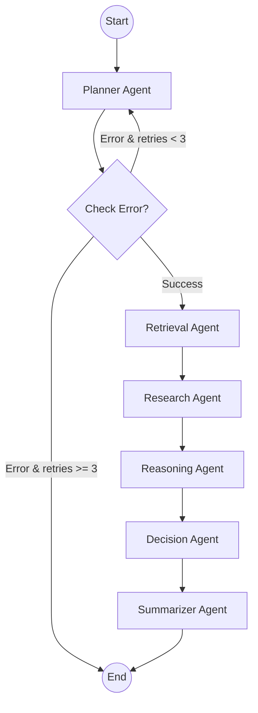

# Phase 4: LangGraph Orchestration Architecture

## Architecture Overview

The Agent Workflow Engine is implemented using LangGraph, providing a robust, state-machine-based orchestration layer for our multi-agent ecosystem. This allows us to define clear execution paths, conditional routing, and error recovery mechanisms.

### Graph State Model

We use a strongly-typed dictionary (`EnterpriseGraphState` via `TypedDict`) to act as the shared memory for the graph. This state is passed from node to node, continuously accumulating context.
```python
class EnterpriseGraphState(TypedDict):
    input: str
    subtasks: list[str]
    retrieved_docs: list[str]
    evidence: str
    analysis: str
    recommendations: list[str]
    final_report: str
    error: str | None
    retries: int
```

### Graph Execution Flow

The workflow is modeled as a Directed Acyclic Graph (DAG) with loops allowed for error recovery.



### Design Decisions

* **Resilience**: The graph introduces a conditional routing edge after the `Planner` node. If the planner fails to decompose the task, the graph will loop back and retry (up to 3 times) before failing gracefully. This is critical for enterprise LLM operations where transient hallucination or API errors occur.
* **Separation of Graph and Agents**: Agents are ignorant of the graph structure. They simply implement a `run(state)` method. `enterprise_graph.py` wraps these in node functions. This allows us to reuse agents in multiple different graphs.
